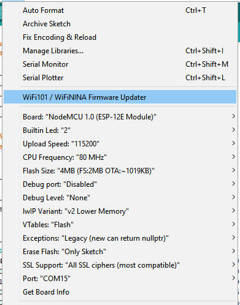

# NodeMCU V2
About NodeMCU V2

## How To use with Arduino IDE

0. Install **NodeMCU V2** Driver

    - **Windows 10**  

1. Install **Arduino IDE** and open it
2. Goto `File` → `Preferences`

   Add this url `http://arduino.esp8266.com/stable/package_esp8266com_index.json` in **Additional Board Manager URLs**

3. Goto `Tools` → `Board` → `Board Manager` then install `ESP32`

4. Goto `Tools` → `Board` then select setting follow this image

    

## Architecture

From [https://www.circuitspecialists.com/blog/wp-content/uploads/2018/06/NodeMCU-ESP8266-Pinout.jpg](https://www.circuitspecialists.com/blog/wp-content/uploads/2018/06/NodeMCU-ESP8266-Pinout.jpg)
